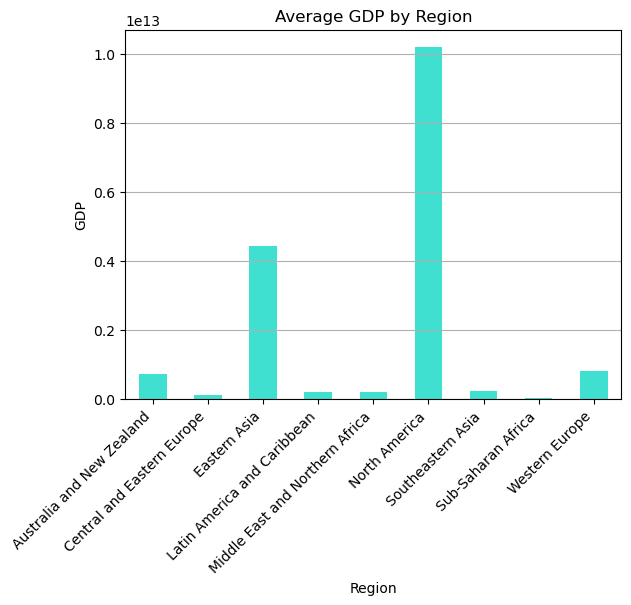
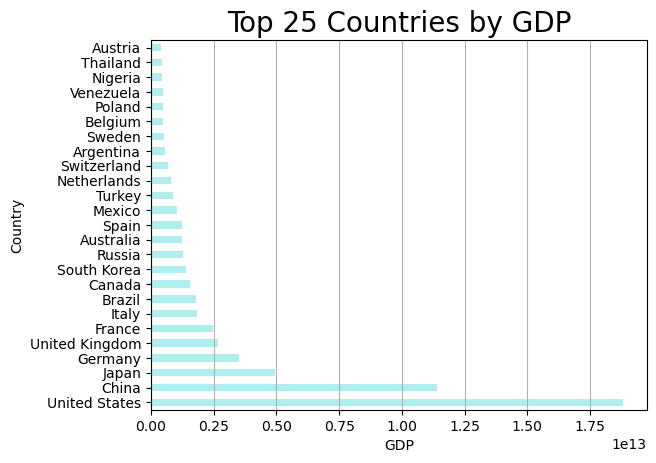
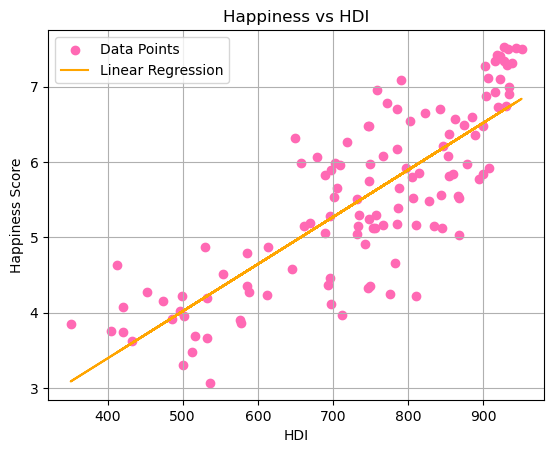
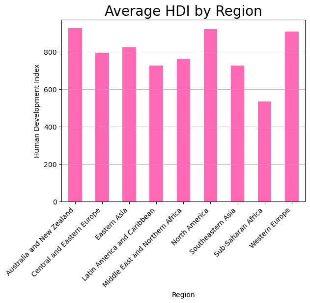
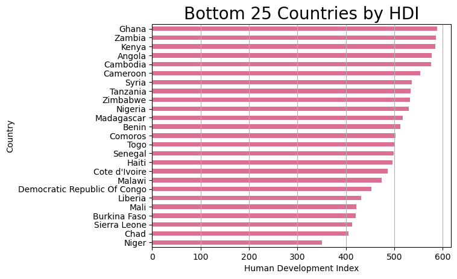

# Data Analytics Boot Camp
## Project 1 by Breakout Room 3
### Happiness, Success Measures, and Alcohol

**Team** //
Matt Casey /
Reed Erickson /
Bryan Johnson /
Tom Regan /
Eyasu Yilma

_____  _____  _____  _____  _____  _____  _____  _____  _____  _____

**Our Questions**
What's the point of life, the universe, and everything? The answer is a resounding '42', as calculated by the fictional super-computer Deep Thought (always know where your towel is). More seriously though, surely the point of our lives is to maximize human happiness. With that in mind, we thought it might be interesting to investigate happiness and several things that it correlates with.

1. For starters, what are the happiest countries around the world?
2. Is happiness correlated with measures of national success; for example: Gross Domestic Product (GDP) and Human Development Index (HDI)?
3. Is happiness impacted by alcohol consumption?
4. Do the types of alcohol consumed seem to influence happiness differently?

_____  _____  _____  _____  _____  _____  _____  _____  _____  _____

**Sidebars**
Background information for those in need!

*Gross Domestic Product (GDP)*
GDP is a measure of how much value a country creates through the production of goods and services. If you take a country's GDP and divide that number by its population, the result is GDP Per Capita, which is a rough estimate of how much value each person contributed to the economy. These values are usually stated on a per annum basis and they can vary wildly across countries and regions.

To provide a sense of the scale, the United States GDP in our dataset is nearly $19 Trillion while China - a country with five times as many people - has a GDP of $11 Trillion. To help put GDP into perspective, we calculate GDP Per Capita as it helps us to normalize GDP across countries with wildly different size population. In our dataset, Luxembourg has the highest GDP Per Capita ($100,739) while Malawi has the lowest GDP Per Capita ($300).

One final note: GDP Per Capita doesn't equate to what the average individual earns. That's an entirely different conversation!

*Human Development Index (HDI)*
From Wikipedia, "the Human Development Index (HDI) is a statistical composite index of life expectancy, education (mean years of schooling completed and expected years of schooling upon entering the education system), and per capita income indicators, which is used to rank countries into four tiers of human development." Longer lifespans, greater access to education, and greater gross national income (GNI) lead to higher HDI scores.

_____  _____  _____  _____  _____  _____  _____  _____  _____  _____

**The Data**
*Source 1*
Sourced from Kaggle.com, we identified a dataset that provided insight into happyiness, measures of national success (e.g., Gross Domestic Product), and alcohol consumption. The data is as of 2016.

[Kaggle Link](https://www.kaggle.com/datasets/marcospessotto/happiness-and-alcohol-consumption/data)

Things to know about this dataset:
1. Happiness was rated on the scale of 1 to 10 by country, based on a survey previously conducted.
2. Measures of national success included Gross Domestic Product (GDP) and Human Development Index (HDI).
3. Alcohol consumed per capita is broken down into type with separate columns for beer, spirits, and wine.
4. While the dataset included several columns of data per capita, it didn't include each country's population data.
5. The GDP Per Capita column used decimals, instead of commas, to represent thousands - this required some pre-processing.

*Source 2*
Sourced from Kaggle.com, we identified a dataset that provided data on Global Population Trends for years 2016 - 2022. Our first dataset contains 2016 data so we isolated the most complete set of data from the file for the countries in the original file. We determined that the best year for us to match against was 2018.

[Kaggle Link](https://www.kaggle.com/datasets/alitaqi000/global-population-trends2016-2022)

**Processing**
1. We imported the file from Source 1 as a CSV file.
2. We performed an inner join from Source 1 to the Source 2 file using the Country field. We dropped one country from our original data set due to a lack of a match.
3. We applied a mask to the merged dataset to convert the decimals used as thousands indicators in the GDP Per Capita column to commas, like a sane person.

_____  _____  _____  _____  _____  _____  _____  _____  _____  _____

**Question 1**
*What are the happiest countries around the world?*

_____  _____  _____  _____  _____  _____  _____  _____  _____  _____

## Happiness, GDP, and HDI
# Gross Domestic Product

The correlation coefficient between GDP and happiness is approximately 0.21. This suggests a positive, but relatively weak, correlation between a country's Gross Domestic Product (GDP) and its reported level of happiness.

The top 5 countries by GDP are the United States, China, Japan, Germany, and the United Kingdom.
Notably, the majority of these top countries are located in the northern hemisphere, with the exception of Australia, which is in the southern hemisphere.

The bottom 5 countries by GDP include Comoros, Belize, Liberia, Republic of Congo, and Suriname. These countries have significantly lower GDP values compared to the top-ranking nations. Similar to the top 25, the majority of these countries are in the northern hemisphere.

# Human Development Index

The correlation coefficient between HDI and happiness is approximately 0.01. This suggests a very weak positive correlation between a country's Human Development Index (HDI) and its reported level of happiness.

The top 5 countries by HDI are Norway, Switzerland, Australia, Germany, and Ireland.
These countries are spread across different regions, with a mix of northern and southern hemisphere countries.

The bottom 5 countries by HDI include Niger, Chad, Sierra Leone, Burkina Faso, and Mali. These countries have considerably lower HDI values compared to the top-ranking nations. Most of the bottom 25 countries are located in Sub-Saharan Africa, with a mix of northern and southern hemisphere countries.

_____  _____  _____  _____  _____  _____  _____  _____  _____  _____

**Question 3**
*Is happiness impacted by alcohol consumption?*

_____  _____  _____  _____  _____  _____  _____  _____  _____  _____

**Question 4**
*Do the types of alcohol consumed seem to influence happiness differently?*

_____  _____  _____  _____  _____  _____  _____  _____  _____  _____

**Sources**
*Data Links*
01. [Happiness, GDP, HDI, and Alcohol Consumption](https://www.kaggle.com/datasets/marcospessotto/happiness-and-alcohol-consumption/data)
02. [Population Data](https://www.kaggle.com/datasets/alitaqi000/global-population-trends2016-2022)

_____  _____  _____ 

*Images*
001. https://en.wikipedia.org/wiki/Human_Development_Index
002. https://www.investopedia.com/terms/g/gdp.asp
003. https://www.teepublic.com/sticker/12264344-42-is-the-answer-hitchhikers-guide-to-the-galaxy-b
004. https://en.wikipedia.org/wiki/Smiley
005. https://en.wikipedia.org/wiki/Gross_domestic_product
006. https://www.winespectator.com/articles/does-it-matter-what-you-drink
007. https://en.wikipedia.org/wiki/Spreadsheet
008.
009.
010.

_____  _____  _____  _____  _____  _____  _____  _____  _____  _____
